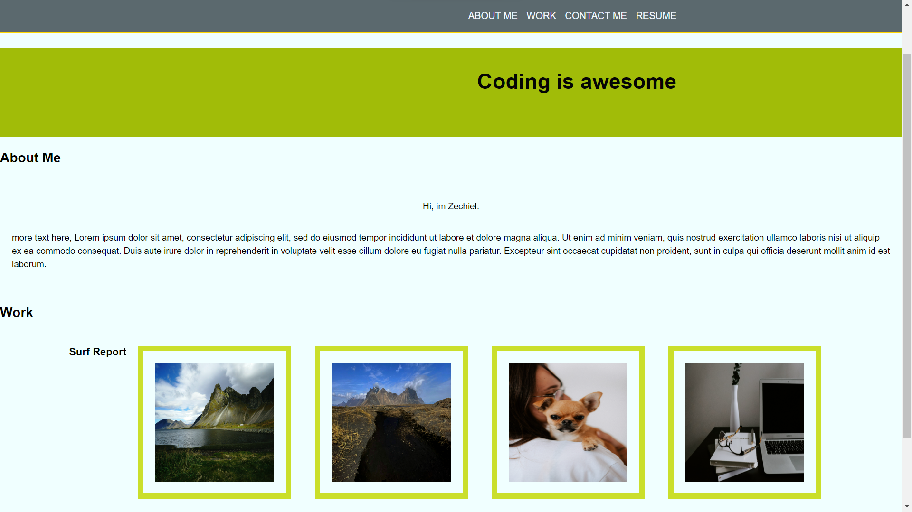

# Portfolio

##professional portfolio mark up

the intent behind this portfolio page was to make a skeleton page using html and style the webpage using the CSS flexbox lay out. This is my first time ever styling a webpage, so I learned quite a few things. One important thing was being case sensitive. 

